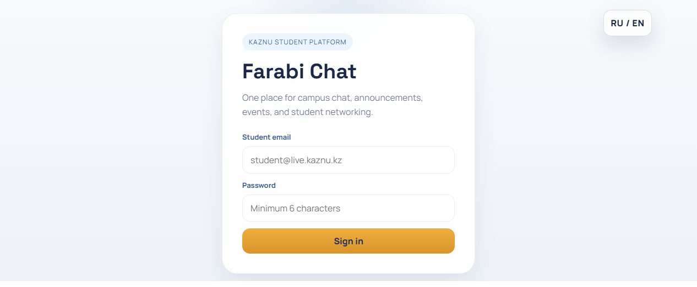
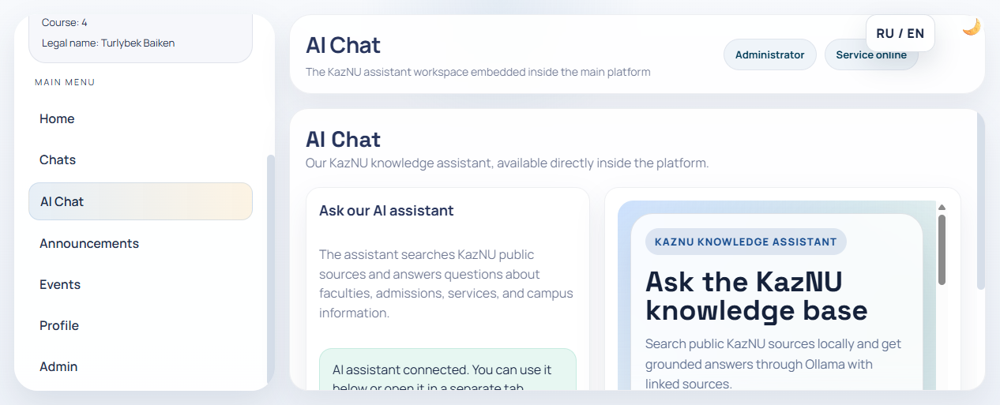
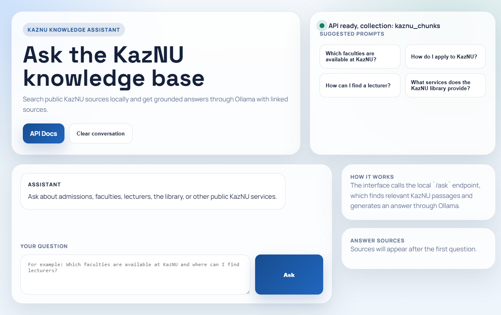

# Farabi Chat for KazNU

Farabi Chat is a student communication platform for Al-Farabi Kazakh National University. It combines campus chat, announcements, events, student profiles, and a local AI knowledge assistant in one interface.

## Why This Project Exists

KazNU students usually have to switch between several disconnected channels: group chats, announcements, event posts, faculty information, and separate search tools. That fragmentation creates three problems:

- important campus updates are easy to miss
- communication is scattered across unrelated platforms
- students do not have one simple place to ask questions about faculties, admissions, lecturers, library services, or university resources

This project was created to solve that problem with one university-focused web platform.

## Project Goal

The goal of Farabi Chat is to provide a single digital hub where a KazNU student can:

- sign in with a university identity
- communicate in topic-based chat rooms
- view announcements and events
- manage a profile inside the same system
- open an integrated AI assistant that answers questions using KazNU public sources

In short: one platform instead of many disconnected tools.

## What The Project Includes

- a Node.js web application for the main student platform
- a FastAPI-based AI assistant workspace for KazNU knowledge search
- Russian and English interface support
- simplified login flow for local demo and presentation
- demo-friendly in-memory fallback when MongoDB is not available
- end-to-end Playwright coverage for the core user flows

## Screenshots

### Login Screen



### Embedded AI Section Inside The Main App



### Standalone KazNU AI Workspace



## Main Features

- KazNU-focused student platform with a clean login screen
- chat rooms grouped by faculty, specialty, and university life categories
- announcements and events in the same interface
- student profile management
- admin tools for content management
- RU / EN language toggle
- integrated AI Chat section inside the main platform
- standalone AI assistant page with source-grounded answers
- local demo mode for presentation without full external setup

## Architecture

### Main Web App

- frontend: vanilla HTML, CSS, and JavaScript from `public/`
- backend: Express + Socket.IO from `server.mjs`
- validation helpers: `validators.mjs`
- optional MongoDB persistence with demo fallback when MongoDB is unavailable

### AI Knowledge Assistant

- FastAPI app in `kaznu-rag/app/main.py`
- local document retrieval over KazNU data chunks
- local integration with Ollama
- standalone chat UI in `kaznu-rag/app/static/`
- embedded into the main app through the `AI Chat` section

## Tech Stack

### Main Platform

- Node.js
- Express
- Socket.IO
- MongoDB / Mongoose
- Vanilla JavaScript
- Playwright

### AI Service

- Python 3.12
- FastAPI
- Qdrant client
- Sentence Transformers
- Ollama

## Project Structure

```text
kaznu-chat/
├── public/                # Main frontend
├── tests/                 # Playwright end-to-end tests
├── server.mjs             # Main Express server
├── validators.mjs         # Shared validation helpers
├── kaznu-rag/             # AI assistant service
│   ├── app/
│   ├── crawler/
│   ├── data/
│   ├── scripts/
│   └── requirements.txt
└── README.md
```

## Quick Start

### 1. Main Platform

Open the actual project root:

```bash
cd kaznu-chat
```

Install Node.js dependencies:

```bash
npm install
```

Create `.env` from `.env.example` and use values like this for local demo:

```env
PORT=3001
MONGO_URI=mongodb://localhost:27017/kaznu-chat
MAIL_USER=your_email@gmail.com
MAIL_PASS=your_app_password
DISABLE_EMAIL=true
NODE_ENV=development
```

Start the web app:

```bash
npm start
```

Open:

```text
http://127.0.0.1:3001
```

### 2. AI Assistant Service

Use Python 3.12. This repository was verified locally with a virtual environment in `kaznu-rag/.venv312`.

Create and activate the environment:

```bash
py -3.12 -m venv kaznu-rag/.venv312
kaznu-rag\.venv312\Scripts\python.exe -m pip install -r kaznu-rag/requirements.txt
```

Start the AI backend:

```bash
cd kaznu-rag
.\.venv312\Scripts\uvicorn.exe app.main:app --host 127.0.0.1 --port 8000
```

Open:

```text
http://127.0.0.1:8000/chat
http://127.0.0.1:8000/docs
```

## Demo Accounts

For the current local demo dataset:

- admin email: `turlybek_baiken@live.kaznu.kz`
- admin password: `admin123`

## Development Commands

```bash
npm start
npm run dev
npm run check
npm run test:e2e
```

- `npm start` starts the main Node.js server
- `npm run dev` starts the server in watch mode
- `npm run check` checks syntax for the main project files
- `npm run test:e2e` runs the Playwright regression suite

## Key API Areas

### Main Platform

- `POST /api/login`
- `GET /api/profile`
- `PUT /api/profile`
- `GET /api/events`
- `POST /api/events`
- `GET /api/announcements`
- `POST /api/announcements`
- `GET /api/runtime-config`

### AI Service

- `GET /health`
- `GET /chat`
- `POST /ask`
- `GET /docs`

## Why This Repository Is Useful

- it demonstrates a complete full-stack student platform
- it solves a real university communication problem
- it includes both a classic web app and an LLM-powered assistant
- it is suitable for coursework, portfolio presentation, and further product development

## Current State

- main site works locally on port `3001`
- AI assistant works locally on port `8000`
- embedded AI section loads inside the main app
- RU / EN toggle is implemented
- local demo flow is working
- Playwright E2E coverage exists for key scenarios

## Future Improvements

- one-command startup for both services
- production deployment guide for Node.js + AI backend
- stronger session/auth model
- persistent media uploads
- richer search and moderation tooling
- deployment configuration for cloud hosting

## KazNU RAG MVP

This repository now also includes an isolated Python starter kit in [kaznu-rag](c:/projects/github/kaznu-chat/kaznu-chat/kaznu-rag) for building a local KazNU knowledge base over public university sources.

Use it when you want a separate retrieval pipeline for:

- crawling public KazNU websites and PDFs
- cleaning and chunking extracted text
- indexing chunks into a local Qdrant database
- answering questions through FastAPI plus Ollama

Quick entry point:

```powershell
cd kaznu-rag
python -m venv .venv
.\.venv\Scripts\activate
pip install -r requirements.txt
Copy-Item .env.example .env
uvicorn app.main:app --reload
```

Full setup details are documented in [kaznu-rag/README.md](c:/projects/github/kaznu-chat/kaznu-chat/kaznu-rag/README.md).

## Deploy On Render

This repository now includes a `render.yaml` file for easy deployment on Render.

Steps:

1. Push the repository to GitHub.
2. In Render, choose `New +` -> `Blueprint`.
3. Select this GitHub repository.
4. Set the required environment variables in Render:
    - `MONGO_URI`
    - `MAIL_USER`
    - `MAIL_PASS`
    - `AUTH_TOKEN_SECRET`
5. Keep `DISABLE_EMAIL=false` if you want real verification emails.
6. Deploy the web service.

The application will start with `npm start` and Render will provide the public URL.

## License

ISC
